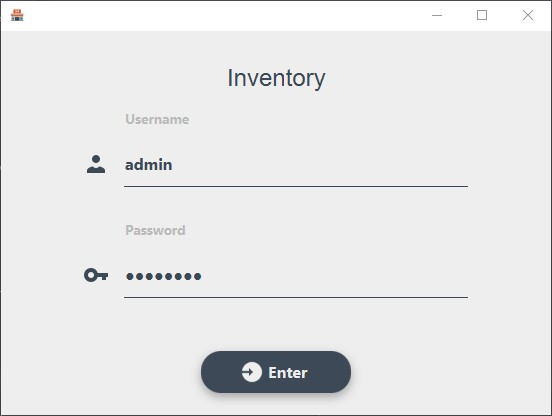
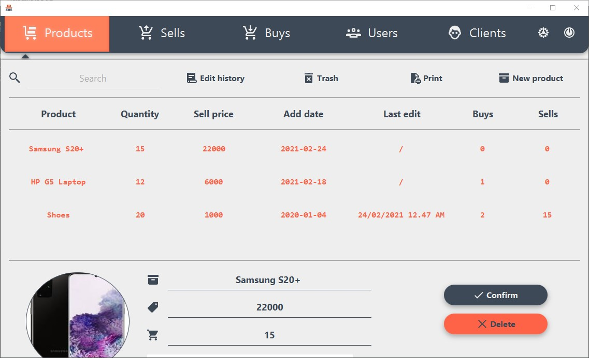
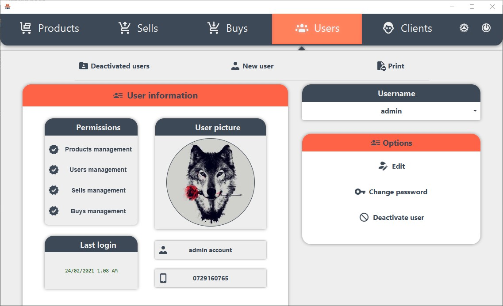
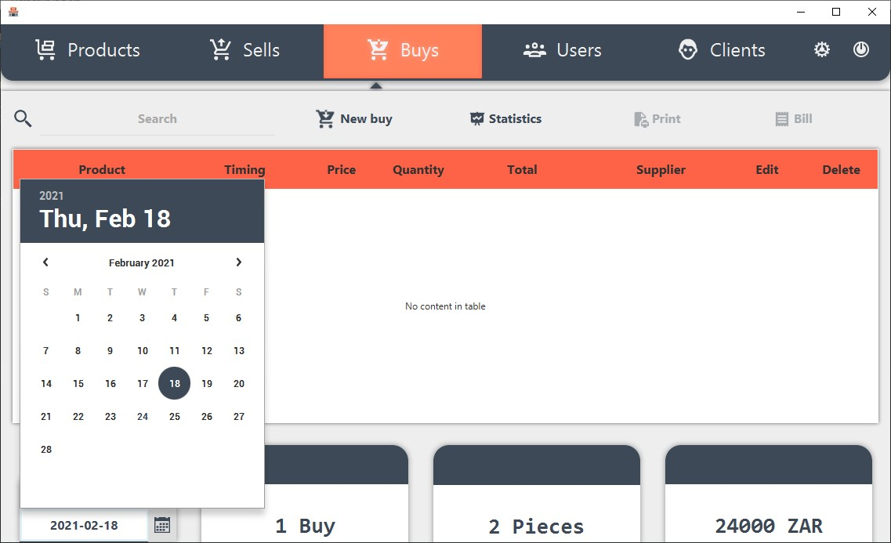
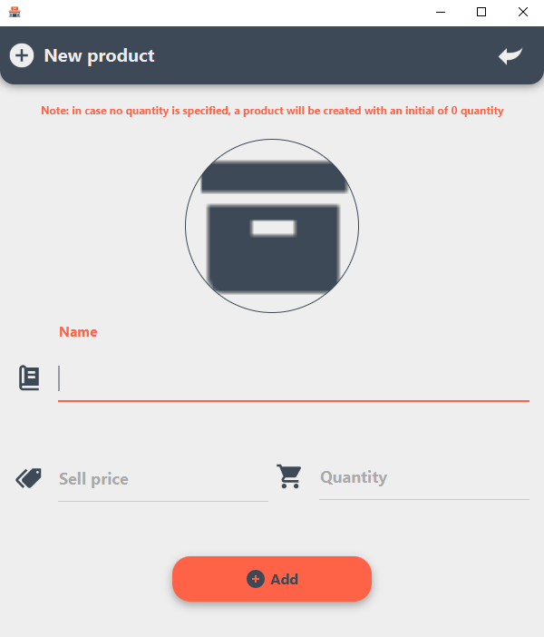
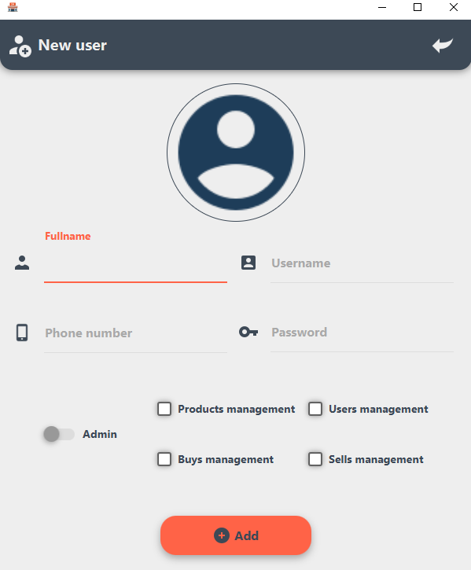

# StockInventoryManager
A JavaFX inventory management application.

## Features:
- [x] Consult/Add/Update/Delete products.
- [x] Retreive freezed products.
- [x] Follow all the updates done by users on products.
- [x] Consult/Add/Update/Delete users and admins.
- [x] Retreive deleted users.
- [x] Check users information.
- [x] Consult/Add/Update/Delete sells and buys.
- [x] Filter sells and buys by date and product name.
- [x] Get the day outcome from sells and buys.
- [x] Get stats about sells/buys with charts and filtering option.
- [x] Print the list of products/users.
- [x] Print the day's list of sells/buys.
- [x] Print sell/buy information
- [x] Print any bill of any selected buys/sells
- [x] Supports English, French and Arabic languages

## IDE
[Netbeans](https://netbeans.org/)

## GUI editor
[SceneBuilder](https://gluonhq.com/products/scene-builder/)

## Used libraries
- [jfoenix-8.0.8](http://jfoenix.com/) (a JavaFX material design library)
- [Appache Commons](http://commons.apache.org/)
- [JasperReports](https://sourceforge.net/projects/jasperreports/)
- [AnimateFX](https://github.com/Typhon0/AnimateFX)

--------------------------------------------------------------------------------------------------------

## Screenshots

### Login view

### Products view

### Users view

### Buys view

### Add product view

### Add user view

